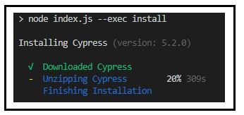

# Clase de Cypress 2020
**Fast, easy and reliable testing for anything that runs in a browser.**
## Introduccion
Dentro de la carpeta ```cypress > integration > examples``` estan los ejemplos por defecto de cypress para usarlos de referencia.


Creo que Rappi tiene dos pantallas de inicio y elige cual mostrarte aleatoriamente, por eso a veces rompe el smoke test, eso va a haber que revisarlo, si es asi se nos va a complicar :/

## Como iniciar el proyecto
1. En la carpeta raíz del proyecto descargar las dependencias con:
```
npm i
```
 
2. Iniciar Cypress con el comando:
```
npm test
```


- [Página oficial](https://www.cypress.io/)
