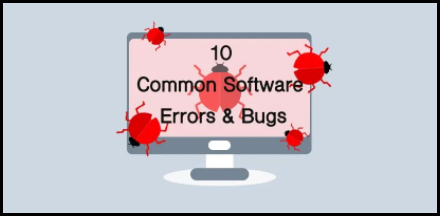
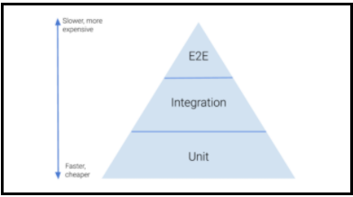
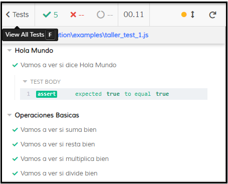
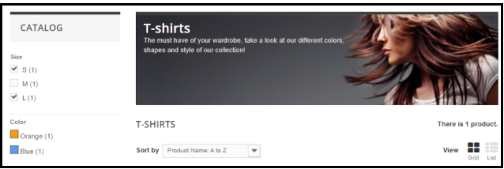
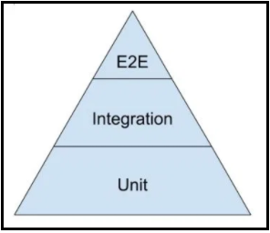

# Clase de "Test End to End" con


## Introduccion
Ya conocemos los primeros dos tipos de tests:
 - **Test unitario:**  busca probar una pequeña funcionalidad específica y aislada.
- **Test de integración:** busca probar la comunicación e interacción entre dos o más módulos del sistema.


La idea fundamental detrás de cualquier test que diseñemos consiste en establecer unas condiciones iniciales y verificar el cumplimiento de unas condiciones finales luego de realizar una cierta acción.



## Testeo end to end
Los test **end to end** buscan testear la funcionalidad completa del sistema desde el punto de vista del usuario, simulando las acciones de entrada de más alto nivel ignorando prácticamente todos los detalles de implementación.

Una forma de lograr este objetivo es realizar una ejecución manual, lo cual de más está decir es muy poco escalable y fiable, es por eso que para llevar a cabo las pruebas E2E existen frameworks y soluciones para automatizar esta tarea. 



## ¿Qué es Cypress?
[Cypress](https://www.cypress.io/) es un framework en **Javascript** utilizado para automatizar pruebas sobre aplicaciones web. Para conseguirlo lo que hace es generar una instancia de un navegador y permite, de forma programática, interactuar con el propio html de la página para simular acciones humanas dentro de la aplicación.

## ¿Cómo empiezo?
Cypress se apoya sobre Node, de forma que su integración con los frameworks web más comunes es muy limpia, se instala con el comando:

```
npm install cypress --save-dev //instalamos las dependencias
```

El archivo **“cypress.json”** es el más importante para poder correr las pruebas. Con la propiedad **“baseUrl”** establecemos el dominio base sobre el cuál vamos a levantar el navegador y con la propiedad **"testFiles"** establecemos las rutas hacia los archivos donde escribimos los tests. Cypress corre su propia instancia y embebe la página a testear dentro de él, esto a menudo causa problemas al intentar acceder recursos de otros dominios por culpa del [CORS](https://developer.mozilla.org/es/docs/Web/HTTP/Access_control_CORS) ya que el **“dominio”** de cypress puede no tener acceso al recurso buscado. Existen [mejores](https://docs.cypress.io/guides/guides/web-security.html#Disabling-Web-Security) soluciones, pero si nada funciona podemos deshabilitar las verificaciones de seguridad del navegador poniendo en false la propiedad **"chromeWebSecurity"**.
Una vez que estemos listos, con el siguiente comando podemos ejecutar las pruebas.

```
npx cypress open
```

## Buenisimo ¿Y cómo escribo un test?

Los tests de cypress se escriben en javascript. Para aclararle al editor que estemos usando que nos autocomplete con sugerencias de cypress tenemos que agregar ```/// <reference types="cypress" />``` al principio del archivo.

### Ej 1: Test Inicial, el famoso **“Hola Mundo”:**
```javascript
describe("Hola Mundo", function () {
  const saludo = "Hola Mundo";
  it("Vamos a ver si dice Hola Mundo", function () {
    expect(saludo === "Hola Mundo").to.equal(true);
  });
});
```
- **“describe”:** Dónde está el grupo de test.
- **“it”:** El caso de la prueba.



Cypress nos provee la keyword ```“cy“``` para acceder a sus funciones.

### Ej 2: Login en Maquetado:
```javascript
describe("Maquetado", function () {
  it("Title", function () {
    cy.visit("./maquetado/index.html");
    cy.get('.content__title--logo').contains('Food Overflow');
    cy.get('#username').type('Linus Torvalds');
    cy.get('#password').type('123456');
  });
});
```
- **“#”:** Es para encontrar la etiqueta html por **“id”**.
- **“.”:** Es para encontrar la etiqueta html por la **“clase”**.

Estas son las sentencias más habituales:

- ```cy.visit('/profile/1234')``` Nos permite navegar hacia esa dirección (tomando como base la baseUrl indicada en el cypress.json).
- ```cy.get('p').contains('Titulo')``` Nos permite obtener todas las etiquetas “p” que dentro contengan el texto “Titulo”.
- ```cy.get('a').contains('Ayuda').click()``` Nos permite hacer click en la etiqueta “a” que dentro contenga el texto “Ayuda”.
- ```cy.get('input[class="nombre"]').clear()``` Nos permite limpiar el campo input cuya clase css sea “nombre” y ```cy.get('input[class="nombre"]').type('Algo 3')``` Nos permite escribir “Algo 3” en el campo.

## Selectores get y contains
jQuery es una biblioteca para javascript que principalmente simplifica la forma de interactuar con el DOM. El estándar de cypress para obtener elementos del DOM es ```cy.get``` , que tiene una sintaxis similar a la empleada en jQuery.

### Ej 3: Vamos a buscar un vestido:
```javascript
describe("Search a dress", function () {
  it("Title", function () {
    cy.visit("http://automationpractice.com/index.php");
    cy.get("#search_query_top").type("dress");
    cy.get('#searchbox > .btn').click();
    cy.get('.lighter').contains('"dress"');
    cy.get('[placeholder="Search"]').clear();
  });
});
```


Más sentencias útiles:

- ```cy.get('p')``` para  buscar una etiqueta en particular.
- ```cy.get('ul li')``` para buscar una etiqueta en particular dentro de otra.
- ```cy.get('[(click)="buy"]')``` para buscar una propiedad en particular sin importar la etiqueta hacemos.
- ```cy.get('button[(click)="buy"]')``` para buscar la misma propiedad para una cierta etiqueta hacemos.

Este tipo de selector es **muy** importante ya que es el que nos va a permitir hacer una selección como la siguiente:
```cy.get('button[data-test-id="login-button"]')```

Ahora bien, si nosotros además de la etiqueta y las propiedades queremos buscar por el contenido que está dentro de las etiquetas tendremos que usar ```cy.contains``` que recibe dos parámetros, un selector y el contenido a buscar. 
ej: ```cy.contains('h1[data-test-id="title"]', 'Welcome')```

### Ej 4: Test Check and Select
```javascript
describe("Test Check and Selects", function () {
  it("Test check", function () {
    cy.visit("http://automationpractice.com/index.php?id_category=5&controller=category");
  });
 
  it('Check', function(){
    cy.get('#layered_id_attribute_group_1').check();
    cy.get('#layered_id_attribute_group_3').check();
  });
 
  it('Select', function(){
    cy.get('#selectProductSort').select('Product Name: A to Z');
  });
});
```


## Asserts / should
En jest teníamos keyword expect, pero en Cypress usamos la keyword should. Should puede recibir uno o dos parámetros, aquello que queremos afirmar (exists, equals, greater, lower, etc.) y el valor contra el que comparamos de ser necesario, por ejemplo:
- ```cy.get('p').should('exist')```
- ```cy.get('h1[data-test-id="title"]').should('eq', 'Welcome')```

En caso de que queramos afirmar que una determinada etiqueta contiene un texto podemos usar la keyword ```contains``` (igual que cuando la empleamos como selector) y si esa es la última sentencia del test Cypress asume que esa línea es un assert.

### Ej 5: Test API Local:

```javascript
describe("Test the api", function () {
  it("status should be 200", () => {
    cy.request({
      method: "get",
      url: "http://localhost:9000/inbox/1",
    }).then((response) => {
      expect(response.status).to.equal(200);
    });
  });
 
  it("Return 6 items", () => {
    cy.request("http://localhost:9000/inbox/1")
      .its("body")
      .should("have.length", 6);
  });
 
  it("Login", () => {
    cy.request("POST", "http://localhost:9000/login", {
        "userName": "usr1",
        "password": "123"
    }).then((response) => {
      expect(response.body).to.have.property("nombre", "Mariano"); // true
    });
  });
});
```

### Ej 6: Test API Remota:
```javascript
import { baseURPokemon } from '../../../cypress';
describe('API Testing with Cypress', () => {
 
   beforeEach(() => {
    cy.request(`${baseURPokemon}/25`).as('pikachu');
   });
 
   it('Validate the header', () => {
       cy.get('@pikachu')
           .its('headers')
           .its('content-type')
           .should('include', 'application/json; charset=utf-8');
   });
 
   it('Validate the status code', () => {
       cy.get('@pikachu')
           .its('status')
           .should('equal', 200);
   });
 
   it('Validate the pokemon\'s name', () => {
       cy.get('@pikachu')
           .its('body')
           .should('include', { name: 'pikachu' });
   });
});
```
En el archivo cypress.json:
```json
{
    "baseURPokemon": "https://pokeapi.co/api/v2/pokemon"
}
```

## Conclusión
A lo largo de la materia vimos tres diferentes tipos de test, que son complementarios entre sí, como se muestra a continuación los test E2E están encima de la pirámide porque demuestra como es el **flujo en tiempo real**, ya que es muy difícil predecir el comportamiento de los usuarios dentro del sistema. 
En otras palabras, nuestros sistemas tienen que ser robustos y contemplar todas las posibles combinaciones de errores que puede agregar los usuarios dentro de nuestro sistema.



### Ej 7: Test Fernando:
```javascript
describe("Search test a title", function () {
  it("Title", function () {
    cy.visit("https://algo3.uqbar-project.org/home/quienes-somos");
    cy.contains('[id="h.p_dNP1xG_VN3Ke"]', "Fernando Dodino");
  });
});
```